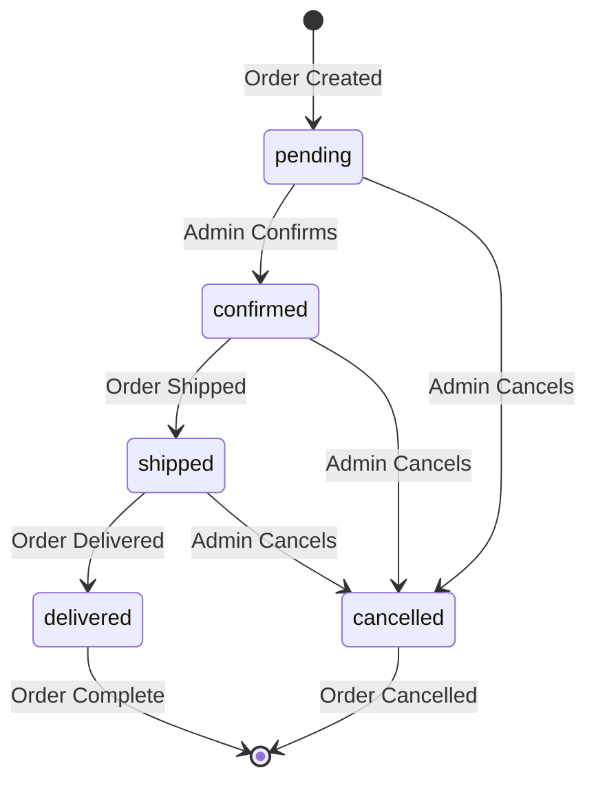
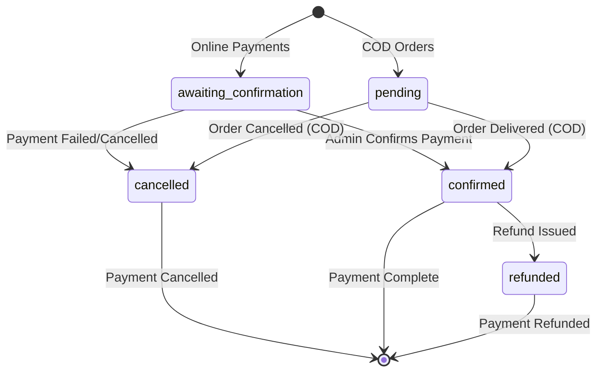

# Admin Order Creation Flow Specification

## Overview
This document outlines the complete flow for creating orders through the admin dashboard. The process involves multiple steps including customer selection, product selection, pricing calculations, payment method selection, and order finalization.

## Current Implementation Status
✅ **Implemented Features:**
- Customer selection with search dropdown
- Product selection with stock validation
- Automatic discount calculation (product + order level)
- Payment method selection
- Delivery address management
- Order summary with pricing breakdown
- Batch quantity adjustment on order creation
- Customer statistics updates

## Detailed Order Creation Flow

### 1. **Access Order Creation Page**
- Navigate to `/dashboard/orders/create`
- Page loads with pre-fetched data:
  - Active customers list
  - Active products with stock data
  - Available payment methods

### 2. **Customer Selection** (Required)
- **UI Component**: `CustomerSearchDropdown`
- **Validation**: Must select a customer before proceeding
- **Data Source**: `CUSTOMERS` collection (active customers only)
- **Features**:
  - Search by name/phone
  - Display customer details (name, phone, address)
  - Auto-populate delivery address from customer data
  - Clear selection option

### 3. **Product Selection & Order Items Management**
- **UI Component**: `ProductOrderSearchDropdown`
- **Data Source**: `PRODUCTS` collection (active products with stock)
- **Process**:
  - Search products by name
  - Display product info: name, image, price, stock, discount
  - Add products to order (one at a time)
  - Prevent duplicate product additions

#### Product Data Enrichment (Server-Side):
```typescript
// For each product, calculate:
- Current stock from batch data
- Product pricing (set directly on product)
- Applicable discounts (product + category level)
- Final price after discounts
- Batch ID for inventory tracking
```

#### Order Item Management:
- **Quantity Control**: Increment/decrement with stock validation
- **Stock Validation**: Cannot exceed available stock
- **Pricing Calculation**:
  - Unit price from product (set directly on product)
  - Product-level discount application
  - Subtotal = (unit_price - discount) × quantity
- **Remove Items**: Delete products from order
- **Real-time Updates**: Pricing recalculates on quantity changes

### 4. **Automatic Discount Calculation**
- **Product-Level Discounts**:
  - Applied per product based on highest applicable discount
  - Calculated server-side during data preparation
  - Includes category and product-specific discounts

- **Order-Level Discounts**:
  - **Trigger**: Recalculates when subtotal or items change
  - **Logic**: Find best active order discount where `minPurchaseAmount ≤ subtotal`
  - **Application**: Percentage-based discount on total order value
  - **UI Feedback**: Shows discount name, percentage, and minimum purchase amount

### 5. **Delivery Information** (Required)
- **Address Input**: Textarea for delivery address
- **Smart Defaults**:
  - Pre-populate with customer's default address
  - "Use Customer's Default Address" button
  - Manual override capability
- **Validation**: Required field, cannot be empty

### 6. **Payment Method Selection** (Required)
- **Available Methods**: Active payment methods from database
- **Types**: `cod`, `easypaisa`, `jazzcash`, `bank_transfer`
- **Payment Status Logic**:
  - **COD**: `paymentStatus = "pending"`
  - **Online Payments**: `paymentStatus = "awaiting_confirmation"`
- **Validation**: Must select payment method

### 7. **Order Summary & Validation**
- **Real-time Calculations**:
  - Subtotal: Sum of all item subtotals
  - Total Discount: Product discounts + Order-level discount
  - Delivery Fee: Currently fixed at 0 (configurable)
  - Final Total: subtotal - discount + delivery_fee

- **Order Information Display**:
  - Order Status: Always "pending" for new orders
  - Payment Status: Based on payment method type
  - Item Count: Number of products in order
  - Pricing Breakdown: Detailed discount information

### 8. **Order Submission & Processing**

#### Pre-Submission Validation:
- Customer selected ✓
- At least one product added ✓
- Delivery address provided ✓
- Payment method selected ✓
- All quantities within stock limits ✓

#### Order Data Structure:
```typescript
{
  customerId: string,
  items: OrderItem[], // With batch IDs for inventory tracking
  subtotal: number,
  discount: number,
  deliveryFee: number,
  total: number,
  paymentMethod: PaymentMethod,
  paymentStatus: PaymentStatus,
  paymentStatusHistory: StatusHistoryEntry[],
  deliveryAddress: string,
  status: "pending",
  statusHistory: StatusHistoryEntry[],
  createdAt: Date
}
```

#### Database Operations:
1. **Create Order Document** in `ORDERS` collection
2. **Update Customer Statistics**:
   - Increment `totalOrders`
   - Add order total to `totalSpent`
3. **Adjust Batch Quantities**:
   - Reduce `remainingQuantity` for each ordered batch
   - Track inventory changes

### 9. **Post-Order Actions**
- **Success Feedback**: Toast notification
- **Navigation**: Redirect to orders list (`/dashboard/orders`)
- **Page Refresh**: Update order list to show new order

## Data Flow Architecture

### Server-Side Data Preparation (`/dashboard/orders/create/page.tsx`):
```
1. Fetch active customers
2. Fetch active products with stock data
3. Calculate product discounts and pricing
4. Fetch payment methods
5. Serialize data for client component
```

### Client-Side Order Building (`OrderCreateForm`):
```
1. Customer selection → Address auto-population
2. Product addition → Quantity management → Pricing updates
3. Discount recalculation → Order summary updates
4. Payment method selection → Status determination
5. Validation → Order submission
```

### Database Updates (`orderService.createOrder`):
```
1. Order document creation
2. Customer statistics update
3. Batch inventory adjustment
4. Error handling and rollback
```

## Order & Payment Status Management Workflows

### Order Status Flow
Order statuses represent the fulfillment lifecycle of an order:



#### Order Status Definitions:
- **`pending`**: Order created, awaiting admin confirmation
- **`confirmed`**: Admin has confirmed the order, ready for fulfillment
- **`shipped`**: Order has been shipped to customer
- **`delivered`**: Order successfully delivered to customer
- **`cancelled`**: Order cancelled by admin (any stage before delivery)
- **`refunded`**: Order refunded (post-delivery cancellations)

#### Admin Status Modification Scenarios:
1. **Order Confirmation**: `pending → confirmed`
   - Admin reviews order details
   - Verifies stock availability
   - Confirms customer details
   - Triggers inventory reduction (if not done at creation)

2. **Order Shipping**: `confirmed → shipped`
   - Admin assigns rider/delivery partner
   - Updates tracking information
   - Notifies customer of shipment

3. **Order Delivery**: `shipped → delivered`
   - Rider confirms delivery
   - Sets `deliveredAt` timestamp
   - Triggers payment completion for COD orders

4. **Order Cancellation**: `any status → cancelled`
   - Admin cancels due to stock issues, customer request, etc.
   - Triggers inventory restocking
   - Initiates refund process if payment was made

### Payment Status Flow
Payment statuses track the payment lifecycle and differ significantly between COD and online payments:



#### Payment Status Definitions:
- **`pending`**: COD orders - payment not yet collected
- **`awaiting_confirmation`**: Online payments - waiting for admin verification
- **`confirmed`**: Payment successfully received/confirmed
- **`refunded`**: Payment refunded to customer
- **`cancelled`**: Payment cancelled or failed

### COD vs Online Payment Workflows

#### **Cash on Delivery (COD) Orders**
```
Order Creation → paymentStatus: "pending"
                 ↓
Order Status Changes:
pending → confirmed → shipped → delivered
                 ↓
Payment Status Changes:
pending → confirmed (auto-triggered on delivery)
```

**COD Payment Rules:**
- Payment status remains `pending` until order is `delivered`
- Admin cannot manually confirm COD payments
- Payment automatically confirmed when order status becomes `delivered`
- No payment screenshot required
- Customer pays rider/delivery partner upon delivery

#### **Online Payment Orders** (Easypaisa, JazzCash, Bank Transfer)
```
Order Creation → paymentStatus: "awaiting_confirmation"
                 ↓
Admin Reviews Payment Proof → paymentStatus: "confirmed"
                 ↓
Order Status Changes:
pending → confirmed → shipped → delivered
```

**Online Payment Rules:**
- Payment status starts as `awaiting_confirmation`
- Admin must review and confirm payment before processing order
- Payment screenshots/confirmation required
- Order cannot be shipped until payment is confirmed

### Admin Payment Confirmation Process

#### **Payment Confirmation Workflow:**
1. **Order Creation**: System sets appropriate initial payment status
2. **Payment Notification**: Customer receives payment instructions
3. **Customer Payment**: Customer completes payment via chosen method
4. **Payment Proof Submission**: Customer provides transaction details/screenshots
5. **Admin Review**: Admin accesses order details and payment proof
6. **Payment Verification**: Admin confirms payment authenticity
7. **Status Update**: Admin changes `paymentStatus` from `awaiting_confirmation` to `confirmed`

#### **Payment Confirmation UI Requirements:**
- **Payment Proof Display**: Image upload/viewer for payment screenshots
- **Transaction Details**: Fields for transaction ID, reference number, amount
- **Payment Method Details**: Display account information for verification
- **Confirmation Actions**: Approve/Reject payment with notes
- **Audit Trail**: Track who confirmed payment and when

#### **Payment Rejection Scenarios:**
- **Invalid Amount**: Payment amount doesn't match order total
- **Wrong Account**: Payment sent to incorrect account
- **Fake Screenshot**: Manipulated or invalid payment proof
- **Expired Transaction**: Payment proof submitted after deadline
- **Incorrect Details**: Transaction ID/reference doesn't match records

### Status Transition Rules & Business Logic

#### **Order Status Transition Permissions:**
```typescript
// Allowed transitions by current status
const orderTransitions = {
  pending: ['confirmed', 'cancelled'],
  confirmed: ['shipped', 'cancelled'],
  shipped: ['delivered', 'cancelled'],
  delivered: [], // Terminal state
  cancelled: [], // Terminal state
  refunded: []  // Terminal state
};
```

#### **Payment Status Transition Permissions:**
```typescript
const paymentTransitions = {
  pending: ['confirmed', 'cancelled'], // COD only
  awaiting_confirmation: ['confirmed', 'cancelled'], // Online payments
  confirmed: ['refunded'], // Can only refund confirmed payments
  refunded: [], // Terminal state
  cancelled: [] // Terminal state
};
```

#### **Interdependent Status Rules:**
1. **Cannot ship unconfirmed payments**: Order status cannot change to `shipped` unless payment status is `confirmed`
2. **Auto-payment confirmation**: COD orders auto-confirm payment when order becomes `delivered`
3. **Refund triggers**: Order status `refunded` automatically sets payment status to `refunded`
4. **Cancellation cascade**: Order cancellation may trigger payment cancellation

#### **Admin Action Validation:**
- **Payment Required for Shipping**: System prevents shipping orders with unconfirmed online payments
- **Stock Validation**: System checks inventory before status changes
- **Business Rules**: Custom validation rules (e.g., no shipping on holidays)
- **Audit Logging**: All status changes logged with admin ID, timestamp, and reason

### Payment Method Specific Handling

#### **Easypaisa/JazzCash (Mobile Wallets):**
- **Confirmation Required**: Transaction ID + sender number verification
- **Screenshot Types**: App transaction screenshot + SMS confirmation
- **Verification Process**: Cross-reference with bank statements
- **Common Issues**: Wrong recipient number, insufficient balance

#### **Bank Transfer:**
- **Confirmation Required**: Transaction reference + bank statement
- **Screenshot Types**: Online banking screenshot + email confirmation
- **Verification Process**: Bank statement reconciliation
- **Common Issues**: Wrong account number, processing delays

#### **COD Specific Handling:**
- **No Pre-payment**: Payment collected at delivery
- **Rider Integration**: Rider app updates payment status
- **Cash Management**: Rider cash collection tracking
- **Dispute Handling**: Customer payment confirmation vs rider reports

### Status History & Audit Trail

#### **Order Status History:**
```typescript
statusHistory: Array<{
  status: OrderStatus;
  updatedAt: Date;
  updatedBy: string; // Admin ID
  notes?: string; // Optional reason/notes
}>
```

#### **Payment Status History:**
```typescript
paymentStatusHistory: Array<{
  status: PaymentStatus;
  updatedAt: Date;
  updatedBy: string; // Admin ID
  transactionId?: string;
  notes?: string;
  attachments?: string[]; // Screenshot URLs
}>
```

#### **Audit Requirements:**
- **Who**: Admin user ID performing the action
- **When**: Exact timestamp of status change
- **What**: Previous status → New status
- **Why**: Reason for status change (optional notes)
- **Evidence**: Payment screenshots, transaction details

## Error Handling & Edge Cases

### Stock Validation:
- Real-time stock checking during quantity changes
- Toast notifications for stock limit violations
- UI prevents exceeding available stock

### Discount Edge Cases:
- Handle products with no applicable discounts
- Order discounts with minimum purchase requirements
- Multiple discount types (percentage, fixed amount)

### Payment Method Logic:
- Automatic payment status based on method type
- Support for multiple online payment providers
- COD handling with manual confirmation workflow

### Data Integrity:
- Batch quantity adjustments with error recovery
- Customer statistics updates with transaction safety
- Order creation rollback on failures


## Order Modification & Cancellation

**Important Business Rule:** Online payment orders cannot be edited or cancelled once created. Only COD orders in `pending` status can be modified or cancelled.

### Order Editing Capabilities

#### **When Orders Can Be Modified**
Orders can be edited by admin **ONLY** when they are in **pending status** and payment method is **COD**. **Online payment orders cannot be edited at all** - they must be cancelled and recreated if changes are needed.

```typescript
// Order editability rules
const canEditOrder = (order: Order): boolean => {
  return order.status === 'pending' && order.paymentMethod.type === 'cod';
};

// Online payment orders are NEVER editable
const canEditOnlinePaymentOrder = (order: Order): boolean => {
  return false; // Online payment orders cannot be edited
};
```

#### **Editable Order Fields**
When `canEditOrder()` returns true, admin can modify:

- **Customer Information**: Change customer, update delivery address
- **Order Items**: Add/remove products, modify quantities
- **Payment Method**: Change from COD to online payment (triggers payment status change)
- **Delivery Address**: Update shipping information
- **Discounts**: Recalculate if items change

#### **Non-Editable Fields**
- **Order ID**: Cannot be changed
- **Creation Date**: Timestamp remains unchanged
- **Payment Status**: Cannot modify directly (changes based on payment method)

#### **Order Edit Process**
1. **Access Edit Mode**: Admin clicks "Edit Order" on pending COD orders
2. **Modify Details**: Use same form as order creation with pre-populated data
3. **Inventory Validation**: Check stock availability for new/modified items
4. **Pricing Recalculation**: Recompute discounts and totals
5. **Save Changes**: Update order with audit trail
6. **Inventory Adjustment**: Adjust batch quantities based on changes

#### **Edit Restrictions After Confirmation**
Once order status changes to `confirmed` or payment is confirmed:
- ❌ Cannot add new products
- ❌ Cannot remove products (must cancel and recreate)
- ❌ Cannot change customer
- ✅ Can modify quantities (if stock available)
- ✅ Can update delivery address
- ✅ Can change payment method (complex business logic required)

### Order Cancellation Rules

#### **Cancellation Eligibility**
```typescript
const canCancelOrder = (order: Order): boolean => {
  // ONLY COD orders can be cancelled if not yet confirmed
  if (order.paymentMethod.type === 'cod') {
    return order.status === 'pending';
  }

  // Online payment orders CANNOT be cancelled
  return false;
};
```

#### **Cancellation Scenarios by Order Status**

**Status: `pending`**
- ✅ **COD Orders**: Full cancellation allowed
- ❌ **Online Payment Orders**: Cannot cancel
- **Actions**: Delete order, restock inventory, update customer stats

**Status: `confirmed`**
- ❌ **COD Orders**: Cannot cancel (fulfillment started)
- ❌ **Online Payment Orders**: Cannot cancel
- **Actions**: N/A

**Status: `shipped`**
- ❌ **COD Orders**: Cannot cancel (in transit)
- ❌ **Online Payment Orders**: Cannot cancel
- **Actions**: N/A

**Status: `delivered`**
- ❌ **All Orders**: Cannot cancel (delivered goods)
- ✅ **Refund Process**: Handle returns/refunds separately

#### **Cancellation Process Flow**
```
Admin Initiates Cancellation
        ↓
Validate Cancellation Eligibility
        ↓
Create Cancellation Record {
  reason: string,
  cancelledBy: adminId,
  cancelledAt: timestamp,
  refundRequired: boolean
}
        ↓
Update Order Status → 'cancelled'
        ↓
Inventory Restocking (if applicable)
        ↓
Customer Statistics Update
        ↓
Payment Processing (refund if needed)
```

#### **Inventory Restocking Logic**
```typescript
const restockCancelledOrder = async (order: Order) => {
  for (const item of order.items) {
    if (item.batchId) {
      // Increase batch remaining quantity
      await adjustBatchQuantity(item.batchId, +item.quantity);
    }
  }
};
```

#### **Customer Statistics Reversal**
```typescript
const reverseCustomerStats = async (order: Order) => {
  const customerRef = doc(db, "CUSTOMERS", order.customerId);
  await updateDoc(customerRef, {
    totalOrders: increment(-1),
    totalSpent: increment(-order.total)
  });
};
```

### Business Rules for Modifications

#### **Stock Availability Checks**
- **Adding Items**: Must have sufficient stock in active batches
- **Increasing Quantities**: Cannot exceed available stock
- **Removing Items**: Always allowed (frees up stock)
- **Decreasing Quantities**: Always allowed

#### **Pricing Recalculation**
- **Discount Re-evaluation**: Recalculate product and order discounts
- **Tax Recalculation**: Update any applicable taxes
- **Total Updates**: Reflect all changes in order total

#### **Audit Trail Requirements**
```typescript
orderEditHistory: Array<{
  editedAt: Date;
  editedBy: string;
  changes: {
    field: string;
    oldValue: any;
    newValue: any;
  }[];
  reason?: string;
}>
```

#### **Modification Restrictions by Payment Type**

**COD Orders (Pre-confirmation):**
- ✅ Full editing capabilities
- ✅ Easy cancellation
- ✅ No payment complications

**Online Payment Orders:**
- ❌ **Cannot be edited** - Must cancel and recreate if changes needed
- ❌ **Cannot be cancelled** - Once created, order is final
- ❌ **No modifications allowed** - Strict policy to prevent payment disputes

### Error Handling & Rollback

#### **Failed Modifications**
- **Stock Insufficient**: Revert all changes, show error
- **Payment Conflicts**: Prevent invalid payment method changes
- **Database Errors**: Rollback partial updates

#### **Cancellation Failure Recovery**
- **Restocking Failures**: Manual inventory adjustment required
- **Customer Stat Errors**: Alert admin for manual correction
- **Payment Refund Issues**: Separate refund tracking system

## Technical Implementation Notes

### Performance Optimizations:
- **Server-side calculations**: Discount and pricing computed on server
- **Batch processing**: Stock data fetched in chunks of 30
- **Lazy loading**: Product search with debounced API calls
- **Memoization**: Pricing calculations cached during session

### Data Consistency:
- **Atomic operations**: Customer stats and batch updates
- **Error recovery**: Rollback mechanisms for failed operations
- **Validation layers**: Client and server-side validation

### Scalability Considerations:
- **Pagination**: Large product catalogs handled efficiently
- **Caching**: Frequent data (customers, payment methods) cached
- **Background processing**: Heavy calculations moved to server

This specification provides a comprehensive blueprint for the admin order creation system, ensuring a smooth, validated, and user-friendly experience for creating orders through the admin dashboard.