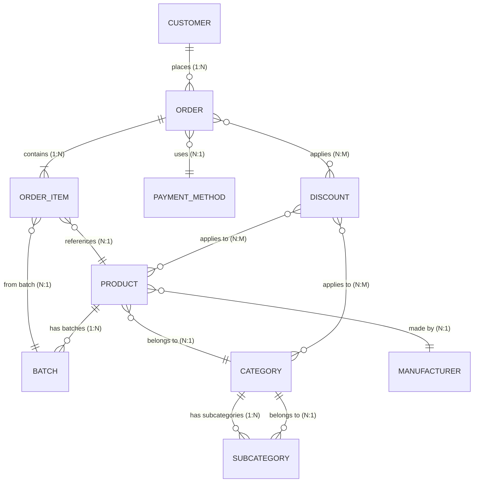

# E-Commerce Backend Architecture

This document provides a comprehensive overview of the backend infrastructure for the e-commerce platform, specifically tailored for mobile app integration. It details how data is stored in Firestore, how to access it, and the key operations needed for customer-facing mobile applications.

## Overview

The backend uses **Firebase Firestore** as the primary database, with **Firebase Storage** for media files. The system is designed as an admin panel with customer-facing capabilities, but this document focuses on the customer/mobile app perspective.

### Technology Stack
- **Database**: Firebase Firestore (NoSQL document database)
- **Storage**: Firebase Storage (for images, videos)
- **Authentication**: Firebase Auth (not detailed here as it's admin-focused)
- **Backend Logic**: Client-side services using Firebase SDK

### Key Collections for Mobile App
- `PRODUCTS` - Product catalog
- `ORDERS` - Customer orders
- `CUSTOMERS` - Customer profiles
- `CATEGORIES` - Product categories
- `SUB_CATEGORIES` - Subcategories under main categories
- `DISCOUNTS` - Discount rules
- `PAYMENT_METHODS` - Available payment options
- `BANNERS` - Homepage/popup banners
- `BATCHES` - Inventory batches (internal, but affects product availability)

## Database Schema

### Entity-Relationship Diagram



## Data Structures

### Customer
```typescript
interface Customer {
  id: string;
  name: string;
  phone: string;
  address?: string;
  totalOrders: number; // Auto-updated when orders are placed
  totalSpent: number;  // Auto-updated when orders are placed
  notificationsEnabled: boolean;
  isActive: boolean;
}
```

**Storage**: `CUSTOMERS/{customerId}`
**Access**: Read/write for customer profile management

### Product
```typescript
interface Product {
  id: string;
  slug: string; // URL-friendly identifier

  // Product Information
  info: {
    name: string;
    nameLower: string; // For case-insensitive search
    description: string;
    categoryIds: string[]; // Format: "categoryId" or "parentCategoryId/subCategoryId"
    manufacturerId: string;
    isActive: boolean;
    productTags: string[];
    allowCustomerReviews: boolean;
    markAsNew: boolean;
    markAsNewStartDate?: Date;
    markAsNewEndDate?: Date;
  };

  // Pricing (directly set on product, not linked to batches)
  price: number;

  // Discounts
  discountIds: string[]; // Associated discount IDs
  featuredDiscountIds: string[]; // Discounts to feature on homepage

  // Inventory
  minimumStockQuantity: number;

  // Media
  multimedia: {
    images: string[]; // Firebase Storage URLs
    video: string; // Firebase Storage URL or YouTube URL
  };

  // Related Products
  similarProductIds: string[];
  boughtTogetherProductIds: string[];

  // Purchase History (for admin)
  purchaseHistory: Array<{
    orderId: string;
    orderDate: Date;
    customerName: string;
    quantity: number;
    unitPrice: number;
    totalAmount: number;
  }>;

  // Computed Stock Data
  batchStock?: {
    usableStock: number; // Non-expired stock
    expiredStock: number; // Expired stock
    totalStock: number; // Total stock
    activeBatchCount: number; // Number of active batches
  };
}
```

**Storage**: `PRODUCTS/{productId}`
**Access**: Read-only for customers (filtered by `info.isActive: true`)

### Category
```typescript
interface Category {
  id: string;
  name: string;
  slug: string;
  description?: string;
  type: "simple" | "special"; // Special for promotions like "Summer Sales"
  displayOrder: number;
  image?: string; // Firebase Storage URL
  subCategoryCount: number;
  isActive: boolean;
  productIds: string[]; // Products directly in this category
  productCount?: number; // Computed count
  showOnHomepage: boolean;
  showOnNavbar: boolean;
  discountIds: string[]; // Discounts applicable to this category
  manufacturerIds: string[]; // Manufacturers with products in this category
  createdAt: Date;
}
```

**Storage**: `CATEGORIES/{categoryId}`
**Access**: Read-only for browsing

### SubCategory
```typescript
interface SubCategory {
  id: string;
  name: string;
  slug: string;
  description?: string;
  displayOrder: number;
  image?: string; // Firebase Storage URL
  parentCategoryId: string;
  isActive: boolean;
  productIds: string[];
  productCount?: number;
  showOnNavbar: boolean;
  discountIds: string[];
  createdAt: Date;
}
```

**Storage**: `CATEGORIES/{parentCategoryId}/SUB_CATEGORIES/{subCategoryId}`
**Access**: Read-only for browsing

### Order
```typescript
interface Order {
  id: string;
  customerId: string;

  // Items
  items: OrderItem[];

  // Pricing
  subtotal: number;
  discount: number;
  deliveryFee: number;
  total: number;

  // Payment
  paymentMethod: PaymentMethod;
  paymentStatus: "pending" | "awaiting_confirmation" | "confirmed" | "refunded" | "cancelled";
  paymentStatusHistory: Array<{
    status: string;
    updatedAt: Date;
  }>;
  proofOfPaymentUrl?: string; // For bank transfers

  // Delivery
  deliveryAddress: string;

  // Status
  status: "pending" | "confirmed" | "shipped" | "delivered" | "cancelled" | "refunded";
  statusHistory: Array<{
    status: string;
    updatedAt: Date;
  }>;

  riderId?: string;
  createdAt: Date;
  deliveredAt?: Date;
}

interface OrderItem {
  productId: string;
  productName: string;
  quantity: number;
  unitPrice: number; // Price at time of order
  discount: number; // Discount applied to this item
  subtotal: number;
  batchId: string; // Which batch this came from
}
```

**Storage**: `ORDERS/{orderId}`
**Access**: Customers can read their own orders (`where customerId == currentUserId`)

### Discount
```typescript
interface Discount {
  id: string;
  name: string;
  description?: string;
  value: number; // Percentage (e.g., 10 for 10%)
  applicableTo: "products" | "categories" | "order";
  applicableProductIds?: string[]; // For product-specific discounts
  applicableCategoryIds?: string[]; // For category-specific discounts
  minPurchaseAmount: number; // For order-level discounts
  startDate: Date;
  endDate: Date;
  isActive: boolean;
  currentUsageCount: number; // Auto-incremented
  createdAt: Date;
}
```

**Storage**: `DISCOUNTS/{discountId}`
**Access**: Read active discounts for price calculations

### Payment Method
```typescript
interface PaymentMethod {
  id: string;
  type: "easypaisa" | "jazzcash" | "bank_transfer" | "cash_on_delivery";
  isActive: boolean;
  displayOrder: number;
  createdAt: Date;
  accountDetails?: {
    accountNumber: string;
    accountTitle: string;
    bankName?: string;
  };
}
```

**Storage**: `PAYMENT_METHODS/{paymentMethodId}`
**Access**: Read active payment methods for checkout

### Banner
```typescript
interface Banner {
  id: string;
  title: string;
  description?: string;
  imageUrl: string; // Firebase Storage URL
  bannerType: "popup" | "homepage";
  linkType: "category" | "product";
  link: string; // categoryId or productId
  isActive: boolean;
  displayOrder: number;
  createdAt: Date;
}
```

**Storage**: `BANNERS/{bannerId}`
**Access**: Read active banners for homepage/popup display

### Batch (Internal Inventory)
```typescript
interface Batch {
  id: string;
  batchId: string; // Barcode/unique identifier
  productId: string;
  manufacturingDate: Date;
  expiryDate: Date;
  quantity: number; // Initial quantity
  remainingQuantity: number; // Updated as items are sold
  supplier?: string;
  location?: string;
  notes?: string;
  isActive: boolean;
  createdAt: Date;
}
```

**Storage**: `BATCHES/{batchId}`
**Access**: Internal use - affects product pricing and availability

## Data Access Patterns

### For Mobile App Customers

#### 1. Browse Products
```javascript
// Get all active products with pagination
const productsRef = collection(db, 'PRODUCTS');
const q = query(
  productsRef,
  where('info.isActive', '==', true),
  orderBy('createdAt', 'desc'),
  limit(20)
);
const snapshot = await getDocs(q);
```

#### 2. Search Products
```javascript
// Case-insensitive search by name
const searchTerm = "laptop";
const productsRef = collection(db, 'PRODUCTS');
const q = query(
  productsRef,
  where('info.nameLower', '>=', searchTerm.toLowerCase()),
  where('info.nameLower', '<=', searchTerm.toLowerCase() + '\uf8ff'),
  where('info.isActive', '==', true),
  orderBy('info.nameLower')
);
```

#### 3. Filter by Category
```javascript
// Products in specific category/subcategory
const categoryId = "electronics/laptops"; // or just "electronics"
const productsRef = collection(db, 'PRODUCTS');
const q = query(
  productsRef,
  where('info.categoryIds', 'array-contains', categoryId),
  where('info.isActive', '==', true)
);
```

#### 4. Get Product Details
```javascript
const productRef = doc(db, 'PRODUCTS', productId);
const productSnap = await getDoc(productRef);
if (productSnap.exists()) {
  const product = productSnap.data();
  // Product includes batchStock with availability info
}
```

#### 5. Browse Categories
```javascript
const categoriesRef = collection(db, 'CATEGORIES');
const q = query(
  categoriesRef,
  where('isActive', '==', true),
  where('showOnHomepage', '==', true),
  orderBy('displayOrder', 'asc')
);
```

#### 6. Get Subcategories
```javascript
const subCategoriesRef = collection(
  db, 'CATEGORIES', parentCategoryId, 'SUB_CATEGORIES'
);
const q = query(subCategoriesRef, orderBy('displayOrder', 'asc'));
```

#### 7. Get Active Discounts
```javascript
const discountsRef = collection(db, 'DISCOUNTS');
const now = Timestamp.now();
const q = query(
  discountsRef,
  where('startDate', '<=', now),
  where('endDate', '>=', now),
  where('isActive', '==', true)
);
```

#### 8. Calculate Product Price with Discounts
```javascript
// Get all applicable discounts for a product
async function getProductPrice(productId) {
  const product = await getDoc(doc(db, 'PRODUCTS', productId));
  const basePrice = product.data().price;

  // Get product-specific discounts
  const productDiscounts = await getDocs(query(
    collection(db, 'DISCOUNTS'),
    where('applicableProductIds', 'array-contains', productId),
    where('isActive', '==', true)
  ));

  // Get category discounts
  const categoryDiscounts = [];
  for (const categoryId of product.data().info.categoryIds) {
    const catDiscounts = await getDocs(query(
      collection(db, 'DISCOUNTS'),
      where('applicableCategoryIds', 'array-contains', categoryId),
      where('isActive', '==', true)
    ));
    categoryDiscounts.push(...catDiscounts.docs);
  }

  // Apply highest discount
  const allDiscounts = [...productDiscounts.docs, ...categoryDiscounts];
  const highestDiscount = allDiscounts.reduce((max, doc) => {
    const discount = doc.data();
    return discount.value > max ? discount.value : max;
  }, 0);

  return basePrice * (1 - highestDiscount / 100);
}
```

#### 9. Place Order
```javascript
async function placeOrder(orderData) {
  // Start batch write for atomicity
  const batch = writeBatch(db);

  // Create order document
  const orderRef = doc(collection(db, 'ORDERS'));
  batch.set(orderRef, {
    ...orderData,
    id: orderRef.id,
    status: 'pending',
    paymentStatus: 'pending',
    createdAt: Timestamp.now()
  });

  // Update customer stats
  const customerRef = doc(db, 'CUSTOMERS', orderData.customerId);
  batch.update(customerRef, {
    totalOrders: increment(1),
    totalSpent: increment(orderData.total)
  });

  // Reduce inventory for each item
  for (const item of orderData.items) {
    // Find available batch (this is simplified - actual logic is more complex)
    const batchRef = doc(db, 'BATCHES', item.batchId);
    batch.update(batchRef, {
      remainingQuantity: increment(-item.quantity)
    });
  }

  await batch.commit();
  return orderRef.id;
}
```

#### 10. Get Customer Orders
```javascript
const ordersRef = collection(db, 'ORDERS');
const q = query(
  ordersRef,
  where('customerId', '==', currentUserId),
  orderBy('createdAt', 'desc')
);
const orders = await getDocs(q);
```

#### 11. Get Active Banners
```javascript
// Homepage banners
const homepageBanners = await getDocs(query(
  collection(db, 'BANNERS'),
  where('bannerType', '==', 'homepage'),
  where('isActive', '==', true),
  orderBy('displayOrder', 'asc')
));

// Popup banner (only one active at a time)
const popupBanner = await getDocs(query(
  collection(db, 'BANNERS'),
  where('bannerType', '==', 'popup'),
  where('isActive', '==', true),
  limit(1)
));
```

## Key Operations for Mobile App

### Product Discovery
1. **Homepage**: Load categories with `showOnHomepage: true`, active banners, featured products
2. **Category Browse**: Load subcategories, then products in category
3. **Search**: Use `nameLower` field for case-insensitive search
4. **Product Details**: Load full product with stock info, related products, applicable discounts

### Shopping Cart & Checkout
1. **Add to Cart**: Client-side only (no backend storage for carts)
2. **Calculate Totals**: Apply discounts, calculate shipping
3. **Payment Methods**: Load active payment methods
4. **Place Order**: Atomic operation updating order, customer stats, and inventory

### Order Management
1. **Order History**: Query orders by customer ID
2. **Order Status**: Real-time updates via Firestore listeners
3. **Reorder**: Use previous order data to create new order

### User Profile
1. **Profile Management**: Update customer info
2. **Order Statistics**: Use `totalOrders` and `totalSpent` from customer document

## Inventory Management

### Stock Tracking
- Products have `batchStock` field computed from active batches
- `usableStock`: Non-expired batches with remaining quantity > 0
- `expiredStock`: Expired batches (for reporting)
- `totalStock`: All stock regardless of expiry

### Batch System
- Each product can have multiple batches with different expiry dates
- Product price is set directly on the product (not derived from batches)
- Orders specify which batch items came from
- Inventory reduced per batch when orders are placed

### Low Stock Alerts
- `minimumStockQuantity` on products for admin alerts
- Mobile app should check `batchStock.usableStock` before allowing purchase

## Discount System

### Discount Types
1. **Product Discounts**: Applied to specific products
2. **Category Discounts**: Applied to all products in category/subcategory
3. **Order Discounts**: Applied to total order amount (minimum purchase required)

### Discount Calculation
- Percentage-based only
- Multiple discounts can apply - highest percentage wins
- Applied at item level and order level
- Usage tracking with `currentUsageCount`

### Active Discount Check
```javascript
function isDiscountActive(discount) {
  const now = new Date();
  return discount.isActive &&
         new Date(discount.startDate) <= now &&
         new Date(discount.endDate) >= now;
}
```

## Payment Processing

### Payment Methods
- **Cash on Delivery**: No payment processing needed
- **Online Payments** (Easypaisa, JazzCash, Bank Transfer): Require account details
- **Bank Transfer**: May require proof of payment upload

### Payment Status Flow
1. `pending` → Initial state
2. `awaiting_confirmation` → Online payment submitted, waiting for admin verification
3. `confirmed` → Payment verified by admin
4. `refunded` → Payment refunded
5. `cancelled` → Payment/order cancelled

## Security Considerations

### Current Setup (Development)
```javascript
// firestore.rules
rules_version = '2';
service cloud.firestore {
  match /databases/{database}/documents {
    match /{document=**} {
      allow read, write: if true; // OPEN ACCESS - NOT FOR PRODUCTION
    }
  }
}
```

### Recommended Production Rules
For mobile app, implement proper security:
- Customers can only read/write their own data
- Products, categories, discounts: read-only for authenticated users
- Orders: customers can only access their own orders
- Use Firebase Auth for user authentication

## Data Synchronization

### Real-time Updates
Use Firestore listeners for real-time data:
```javascript
// Listen to order status changes
const orderRef = doc(db, 'ORDERS', orderId);
const unsubscribe = onSnapshot(orderRef, (doc) => {
  const order = doc.data();
  // Update UI with new status
});
```

### Offline Support
Firestore supports offline data access:
- Data cached locally
- Syncs when connection restored
- Useful for shopping cart persistence

## Performance Optimization

### Query Optimization
1. Use composite indexes for complex queries
2. Limit result sets with pagination
3. Use `array-contains` for category filtering
4. Pre-compute expensive calculations (like stock data)

### Data Fetching Strategy
1. **Lazy Loading**: Load product details only when needed
2. **Pagination**: Use `limit()` and `startAfter()` for large lists
3. **Selective Fields**: Use `select()` to fetch only needed fields
4. **Batch Reads**: Use `getDocs()` with multiple document references

## Error Handling

### Common Scenarios
1. **Out of Stock**: Check `batchStock.usableStock` before adding to cart
2. **Invalid Discounts**: Verify discount validity before applying
3. **Payment Failures**: Handle different payment method errors
4. **Network Issues**: Implement retry logic with exponential backoff

### Validation
- Validate order data before submission
- Check product availability before order placement
- Verify payment method requirements

## Migration Notes

### From Admin Panel to Mobile App
- Customer authentication required
- Implement proper Firestore security rules
- Add user-specific data access controls
- Handle offline data synchronization
- Implement push notifications for order updates

This architecture provides a solid foundation for building a feature-rich e-commerce mobile app with real-time inventory, discount management, and order tracking capabilities.