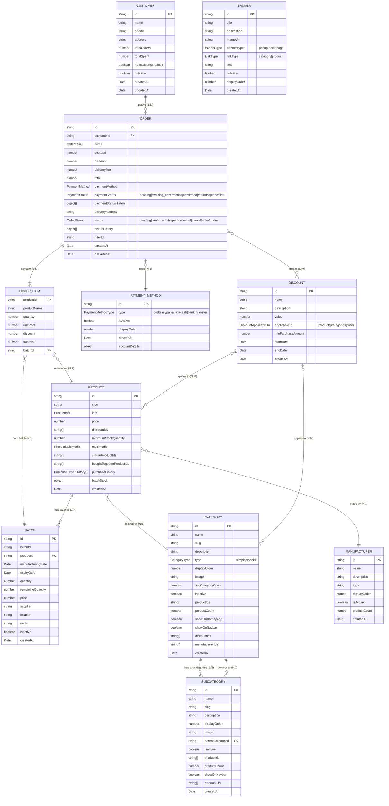

# Database Schema ERD

This document contains the Entity-Relationship Diagram for the current database schema, unified between the code implementation and requirements.md.

The diagram is in Mermaid format, which can be imported into draw.io (diagrams.net) for editing:
1. Open draw.io
2. Create new diagram
3. Go to File > Import From > Text/Mermaid
4. Paste the Mermaid code below

### Key Notes:
- **Unified Status Names**: Order and Payment statuses now match requirements.md exactly
- **Consistent createdAt Fields**: All entities now have createdAt timestamps for tracking
- **Complete Relationships**: All foreign keys and relationships are properly defined
- **Collections**: Firestore collections are uppercase (e.g., ORDERS, CUSTOMERS)
- **Data Types**: All fields have proper TypeScript types specified
- **Complex Objects**: Nested objects like ProductInfo, ProductMultimedia are shown as object types

### Status Alignments (Requirements vs Code):
- **OrderStatus**: `pending|confirmed|shipped|delivered|cancelled|refunded` ✅
- **PaymentStatus**: `pending|awaiting_confirmation|confirmed|refunded|cancelled` ✅
- **All entities**: Include `createdAt` field for consistency ✅